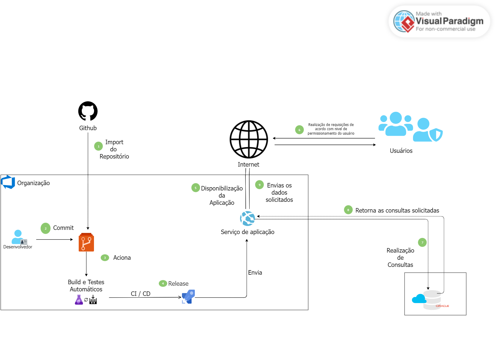

# Integrantes

RM551191 - Diego Mascarenhas Santos (2TDSPV)

RM98482 - Sarah Oliveira Souza Rosa (2TDSPV)

RM97798 - Ester Dutra da Silva (2TDSPV)

RM550981- Henrique Gerson Costa Correia (2TDSPV)

RM99985 - Felipe Batista Gregorio (2TDSPY)

# Descrição do problema a Resolver

O consumo excessivo de energia elétrica nas residências brasileiras não impacta apenas o orçamento
familiar com contas de valores elevados, mas também traz consequências ambientais significativas.
medida que a demanda por energia aumenta, torna-se necessária a expansão da capacidade de
geração, o que pode resultar na construção de novas usinas de energia. Embora fontes de energia
limpa, como hidrelétricas, sejam frequentemente consideradas inofensivas, sua implantação pode
gerar impactos ambientais significativos. Por exemplo, a construção de hidrelétricas frequentemente
altera o curso dos rios, afetando o ecossistema aquático e provocando mudanças nos habitats das
espécies locais. Esses efeitos reforçam a importância de ações que reduzam o consumo energético
em escala doméstica.

# Solução

A solução proposta é uma ferramenta que permite aos usuários monitorar seu consumo de energia
elétrica mensalmente, oferecendo dicas que promovem o uso consciente. Através da aplicação, o
cliente poderá registrar os valores pagos nas contas de luz, considerando fatores como o número de
moradores na residência e a bandeira tarifária vigente no período. Esse monitoramento ajuda a
identificar padrões de aumento no consumo e fornece informações para a adoção de práticas mais
eficientes e sustentáveis. Com isso, o usuário não apenas reduz suas despesas mensais, mas também
contribui para a preservação ambiental, diminuindo a pressão sobre a necessidade de expansão da
infraestrutura de geração de energia.

# Implementações

1. Gestão de perfis com **SpringSecurity** para garantir que somente usuários administradores possam
   realizar modificações importantes;

2. Deploy em nuvem contando também com a construção de um CI/CD (Continuos Integration e Continuos Delivery)
   onde todas as alterações realizadas em código, ao receber um commit serão atualizadas desde o build
   da aplicação a implementação em nuvem;

3. Validações utilizando o **validation** para garantir obrigatoridade no preenchimento de campos;

4. Testes em **Junit** para garantir a boa funcionalidade do código desenvolvido,
   testes esses realizados em um banco de dados separado do banco de dados de produção;

5. **Thymeleaf** para o densenvolvimento de páginas junto ao **Bootstrap** para garantir efeitos
   visuais e ícones para melhorar a experiência do usuário;

6. **Spring Data JPA** para garantir persistência de dados e mapeamento de objetos relacionais;

7. **SpringSecurity5** com ele podemos utilizar a expressão "sec:authorize="hasRole('ROLE_ADMIN')"
   para verificar se o usuário conectado na sessão possui permissão para acessar determinada rota.

8. Criação de um arquivo de layout que contém elementos em comum para diversas páginas.

# Arquitetura da Solução

# Instruções para utilização

A projeto conta com dois tipos de perfis, sendo eles USERS (possui restrições) e
ADMIN (todas as rotas estão liberadas.)
São injetados no banco de dados dois usuários default para garantir o uso inicial da aplicação,
veja abaixo suas credenciais de acesso e nivel de permissão:

1. Usuário: user1 e Senha: password | Permissionamento de usuário comum.
2. Usuário: admin e Senha: admin | Permissionamento de usuário administrador.

# Links

Video pitch:

Video de apresentação do app:

Video de deploy em nuvem: